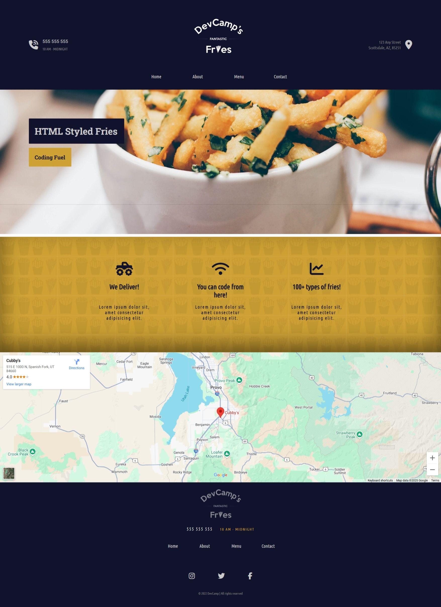
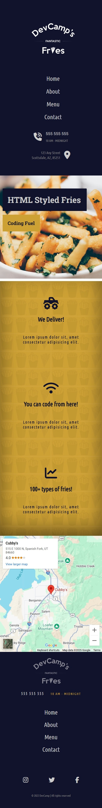

# DevCamp's Fantastic Fries

## Overview
I created this multipage website by following a tutorial from the 2022 Code to Success summer bootcamp. I learned how to use HTML to embed content, create forms, and more. I also learned CSS and practiced creating resuable styling by breaking up my styles into multiple stylesheets, each concerned with a different section of the website. This project helped me gain experience writing clean, scalable, and maintainable CSS code.

## Screenshots
### Desktop

### Mobile

